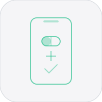

# Dose


iOS health tracker for supplements, medications, and biometrics. 200+ built-in substances with interaction checking, HealthKit integration, CSV export, notifications, widgets, and daily check-ins.

## Features

- 200+ substances (vitamins, supplements, medications, nootropics)
- Interaction checker (contraindications, synergies, timing)
- HealthKit (HR, HRV, SpO2, sleep, steps, energy, distance, weight, BP)
- Dose reminders with quick presets (notifications)
- Home screen widget (today's dose count, active pills)
- Swipe-to-delete history with search
- Backdate doses with timestamp picker
- CSV export, biometric tracking, daily check-ins
- App Group shared data for widget sync

## Roadmap

### v2.1.0 (in progress)
- [x] App icon
- [ ] Unit tests (InteractionEngine, DataStore, CSVExporter, SubstanceDatabase, HealthKitService)
- [ ] Dose reminders via notifications (NotificationService + RemindersView)
- [ ] Home screen widget (WidgetKit, App Group shared data, small + medium sizes)
- [ ] Error handling (lastError on DataStore/HealthKitService, Result type on CSVExporter)
- [ ] Swipe-to-delete in history + search bar
- [ ] Timestamp picker for backdating doses
- [ ] project.yml targets for tests + widget

### v2.2.0 (planned)
- [ ] Charts/trends (dose frequency over time, biometric correlations)
- [ ] iCloud sync (CloudKit or SwiftData migration)
- [ ] Substance notes and custom substances
- [ ] Export to Apple Health (write dose data back to HealthKit)

### v3.0.0 (future)
- [ ] iPad layout (NavigationSplitView)
- [ ] watchOS companion (log doses from wrist)
- [ ] Siri Shortcuts / App Intents
- [ ] Share sheet (import substance lists)

## Setup

```bash
xcodegen generate
open Dose.xcodeproj
```

Requires Xcode 16+, iOS 17+.

## License

MIT 2026 Joshua Trommel
