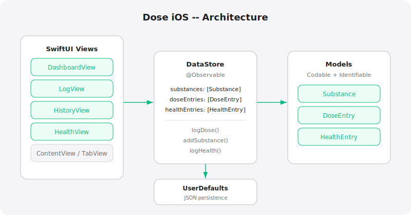

# Dose


iOS health tracker for supplements, medications, and biometrics. 200+ built-in substances with interaction checking, HealthKit integration, CSV export, and daily check-ins.



## Features

- 200+ built-in substances (vitamins, supplements, medications, nootropics)
- Rich dose logging with amount, route, and notes
- Interaction checker (contraindications, synergies, timing)
- Apple HealthKit integration (HR, HRV, SpO2, sleep, steps, energy, distance, weight, BP)
- CSV export for dose history
- Biometric tracking (manual + HealthKit)
- Daily health check-ins (mood, energy, sleep)
- Dashboard with streak tracking
- Full history with search and filtering

## Setup

```bash
cd ~/Documents/Code/dose-ios
xcodegen generate
open Dose.xcodeproj
```

Requires Xcode 16+, iOS 17+.

## Architecture

```
DoseApp.swift           Entry point, TabView (Home, Library, Insights, Body)
Views/
  DashboardView.swift   Home tab - today's doses, streaks
  LibraryView.swift     Substance browser, search, add custom
  HistoryView.swift     Dose history, search, CSV export
  InsightsView.swift    Charts and trends
  BodyView.swift        Biometrics + HealthKit + health check-ins
  LogView.swift         Quick dose logging
  AddDoseSheet.swift    Dose entry form
  SubstanceDetailView   Substance info + interaction warnings
  InteractionCheckerView  Active interaction analysis
Models/
  Substance.swift       Substance model
  DoseEntry.swift       Dose log entry
  HealthEntry.swift     Daily check-in
  BiometricEntry.swift  Biometric measurements
Services/
  DataStore.swift       @Observable, UserDefaults persistence
  HealthKitService.swift  HealthKit read-only integration
  InteractionEngine.swift  Drug interaction analysis
  CSVExporter.swift     Export dose history
Data/
  SubstanceDatabase.swift  200+ built-in substances
```

## Roadmap

- [x] HealthKit integration
- [x] Interaction checker
- [x] CSV export
- [x] Rich dose logging
- [ ] Sync with web app (dose)
- [ ] Notification reminders
- [ ] Widget for today's doses
- [ ] Apple Watch companion

## License

MIT 2026 Joshua Trommel
